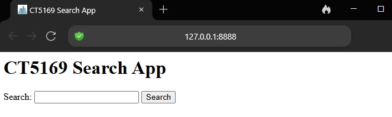
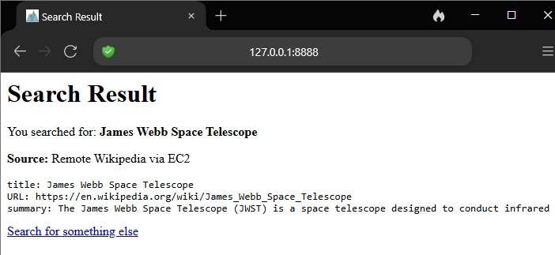
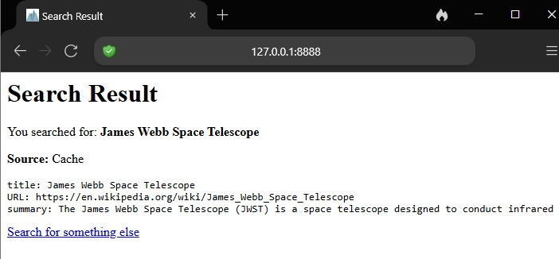
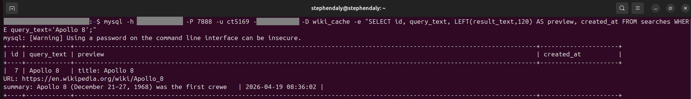
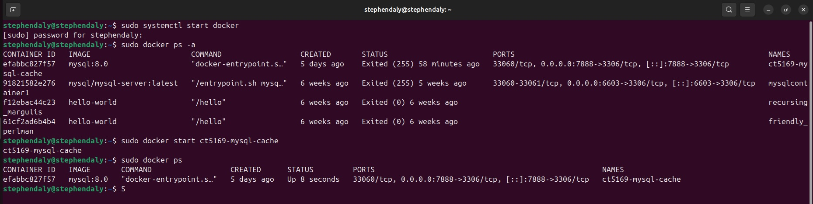
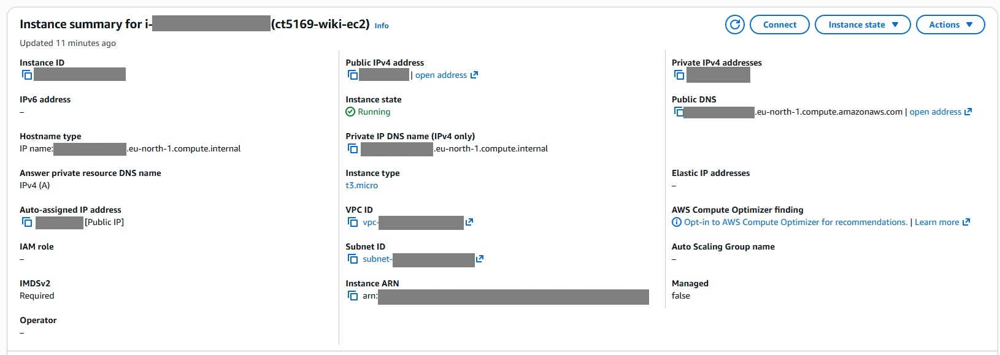
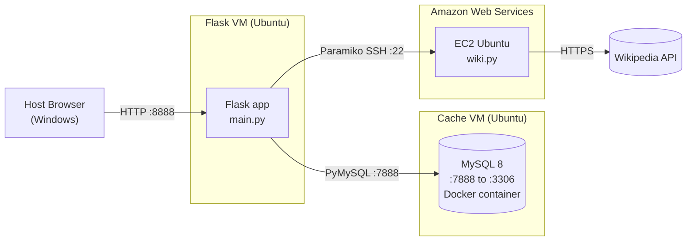

# Distributed Flask Web Application with Remote Wikipedia Search and MySQL Cache


# Distributed Flask Web Application with Remote Wikipedia Search and MySQL Cache

A three-tier distributed web application demonstrating core cloud computing
concepts: VM-to-VM networking, remote script execution over SSH, and
database-backed caching. A Flask front end on one Ubuntu VM orchestrates a
Wikipedia lookup that executes remotely on an Amazon EC2 instance, with a
MySQL cache in Docker on a separate VM between them. Repeat queries are
served from the cache in a fraction of the time.

## See it in action

| Search form | First search (fetched from Wikipedia) | Repeat search (served from cache) |
|---|---|---|
|  |  |  |

The **Source** line on each result page tells you where the answer came from. Searching for `Apollo 8` the first time goes all the way out to Wikipedia via Amazon EC2; searching for `Apollo 8` a second time comes straight back from the local database cache in a fraction of the time.

| Row stored in MySQL | Cache container running | EC2 instance running |
|---|---|---|
|  |  |  |

## What it does

- Takes a search term from a user via a simple web form
- Checks a local database to see if the same question has been asked before
- If not, reaches out to a remote machine running on Amazon Web Services, runs a Wikipedia lookup there, and brings the answer back
- Stores the answer so the next time someone asks the same question, it comes back instantly instead of making the round trip all over again
- Handles errors gracefully so the browser always gets a useful response

## Architecture



Three independent machines, three network boundaries, one cache-aside read path. The Flask VM is the orchestrator in the middle, the Cache VM is the memory, and the EC2 instance is the hands reaching out to Wikipedia on the open internet.

## How it works

1. You submit a query through the web form at `/`.
2. Flask asks the database: have we seen this question before?
3. **If yes** — the stored answer comes straight back, tagged `Source: Cache`.
4. **If no** — Flask opens a secure SSH connection to the EC2 instance, runs a small Python script (`wiki.py`) out there with your query as an argument, captures whatever it prints, writes the result into the database for next time, and sends it back to you tagged `Source: Remote Wikipedia via EC2`.
5. If anything along the way fails, the error is caught and shown on a friendly error page rather than crashing the app.

---

<details>
<summary><strong>Deep dive: setup, configuration, troubleshooting</strong></summary>

## Repository layout

```
.
├── main.py                   # Flask app: routes, cache-aside, Paramiko call
├── paramiko_test.py          # Standalone SSH smoke test for EC2
├── requirements.txt          # Flask, paramiko, pymysql, wikipedia
├── ec2/
│   └── wiki.py               # Remote Wikipedia lookup (runs on EC2)
├── db/
│   ├── schema.sql            # MySQL table definition (auto-applied on first boot)
│   └── docker-compose.yml    # MySQL 8 cache container on port 7888
├── docs/
│   └── screenshots/          # Images used in this README
├── .gitignore
└── README.md
```

## Prerequisites

- **Host** (Windows/macOS/Linux) with a browser
- **Flask VM** — Ubuntu 24.04, Python 3.12, pip, virtualenv, network access to the Cache VM and to EC2 over SSH
- **Cache VM** — Ubuntu 24.04, Docker Engine, Docker Compose, host port 7888 reachable from the Flask VM
- **EC2 instance** — Ubuntu, SSH access, `python3-pip`, `wikipedia` package, security group allowing inbound SSH from the Flask VM's public address

## Environment variables

`main.py` resolves every configurable value from the environment with a placeholder default, so the committed code is safe to share. Real values are supplied at runtime on the Flask VM.

| Variable             | Purpose                              | Example                                       |
|----------------------|--------------------------------------|-----------------------------------------------|
| `EC2_INSTANCE_IP`    | Public IP of the EC2 instance        | `52.0.0.0`                                    |
| `EC2_KEY_FILE`       | Path to the PEM key on the Flask VM  | `/home/stephendaly/ct5169-ca1/CT5169.pem`     |
| `REMOTE_PYTHON`      | Python interpreter path on EC2       | `/home/ubuntu/ct5169-wiki/venv/bin/python`    |
| `REMOTE_SCRIPT`      | Path to `wiki.py` on EC2             | `/home/ubuntu/ct5169-wiki/wiki.py`            |
| `REMOTE_USERNAME`    | SSH user on EC2                      | `ubuntu`                                      |
| `CACHE_DB_HOST`      | Cache VM IP reachable from Flask VM  | `192.168.29.5`                                |
| `CACHE_DB_PORT`      | MySQL host port on the Cache VM      | `7888`                                        |
| `CACHE_DB_NAME`      | Database name                        | `wiki_cache`                                  |
| `CACHE_DB_USER`      | MySQL user                           | `ct5169`                                      |
| `CACHE_DB_PASSWORD`  | MySQL user password                  | *(kept out of version control)*               |

## Setup per tier

### 1. Flask VM

```bash
git clone https://github.com/sdaly-ie/distributed-flask-wiki-cache.git ct5169-ca1
cd ct5169-ca1
python3 -m venv venv
source venv/bin/activate
pip install -r requirements.txt

# Put the EC2 private key in place and tighten permissions
cp /path/to/CT5169.pem ./CT5169.pem
chmod 400 CT5169.pem
```

### 2. Cache VM (MySQL container)

```bash
cd /path/to/ct5169-ca1/db

# Supply real passwords via a .env file (gitignored)
cat > .env <<EOF
MYSQL_ROOT_PASSWORD=your_strong_root_password
MYSQL_PASSWORD=your_strong_user_password
EOF

# Start the container. schema.sql is auto-applied on first boot.
docker compose up -d
docker compose ps
```

### 3. EC2 VM

```bash
sudo apt update
sudo apt install -y python3-venv python3-pip
mkdir -p ~/ct5169-wiki && cd ~/ct5169-wiki
python3 -m venv venv
source venv/bin/activate
pip install wikipedia

# Copy ec2/wiki.py from the repo into ~/ct5169-wiki/wiki.py
```

Security group: open inbound SSH (port 22) from the Flask VM's public address only. Don't leave SSH open to `0.0.0.0/0`.

## Running the application

On the Flask VM, from the project directory with the virtualenv active:

```bash
export EC2_INSTANCE_IP="<real-ec2-ip>"
export EC2_KEY_FILE="/home/stephendaly/ct5169-ca1/CT5169.pem"
export CACHE_DB_HOST="<real-cache-vm-ip>"
export CACHE_DB_PASSWORD="<real-mysql-password>"

python3 main.py
```

Flask starts on `0.0.0.0:8888`. From the host browser:

```
http://<flask-vm-host-only-ip>:8888/
```

The host-only adapter IP is typically in the `192.168.x.x` range and is visible on the Flask VM via `ip -4 addr show`.

## Database schema

```sql
CREATE DATABASE IF NOT EXISTS wiki_cache
    CHARACTER SET utf8mb4 COLLATE utf8mb4_unicode_ci;

USE wiki_cache;

CREATE TABLE IF NOT EXISTS searches (
    id          INT AUTO_INCREMENT PRIMARY KEY,
    query_text  VARCHAR(255) NOT NULL UNIQUE,
    result_text MEDIUMTEXT   NOT NULL,
    created_at  TIMESTAMP    DEFAULT CURRENT_TIMESTAMP,
    updated_at  TIMESTAMP    DEFAULT CURRENT_TIMESTAMP
                             ON UPDATE CURRENT_TIMESTAMP
);
```

The `UNIQUE` constraint on `query_text` is what makes the `INSERT ... ON DUPLICATE KEY UPDATE` in `save_result_to_cache()` a correct upsert. Without it, a repeat search for the same term would raise a duplicate-key error.

## Troubleshooting

**`Address already in use` on Flask startup**
A previous Flask process is still bound to the port. Kill it:
```bash
pkill -f "python3 main.py"
```

**`Can't connect to MySQL server on 'YOUR_CACHE_VM_IP'`**
Environment variables weren't set. Verify with `env | grep CACHE_DB_` before launching Flask.

**`Permission denied (publickey)` on SSH to EC2**
Check the PEM key file mode is exactly `400`:
```bash
chmod 400 CT5169.pem
```
Confirm `EC2_KEY_FILE` points at the correct absolute path.

**`permission denied while trying to connect to the Docker API`**
Your user isn't in the `docker` group on the Cache VM. Either run Docker commands with `sudo`, or add yourself to the group and log out/in:
```bash
sudo usermod -aG docker $USER
```

**Host browser can't reach the Flask VM**
`127.0.0.1` from the host points at the host, not the VM. Use the VM's host-only adapter IP instead (`ip -4 addr show` on the Flask VM — look for the `192.168.x.x` address on `enp0s8` or equivalent).

## Reviewer path

If you're reviewing this for marking or assessment, here's the five-minute tour:

1. **`main.py`** — cache-aside strategy in the `search()` route (the `try:` block with `get_cached_result()` then `fetch_wikipedia_result()` then `save_result_to_cache()`).
2. **`db/schema.sql`** — `UNIQUE` constraint on `query_text` that enables the upsert.
3. **`db/docker-compose.yml`** — MySQL 8 container on port 7888 with `schema.sql` mounted into `docker-entrypoint-initdb.d` so the table is auto-created on first boot, and a named volume so cached rows survive container restarts.
4. **`ec2/wiki.py`** — handles `DisambiguationError` and `PageError` so the Flask side sees useful messages rather than unhandled exceptions.
5. **`paramiko_test.py`** — standalone SSH smoke test, useful for verifying EC2 connectivity independently of Flask.

</details>
